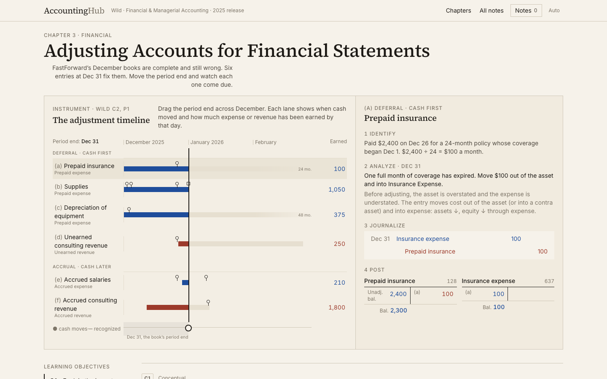
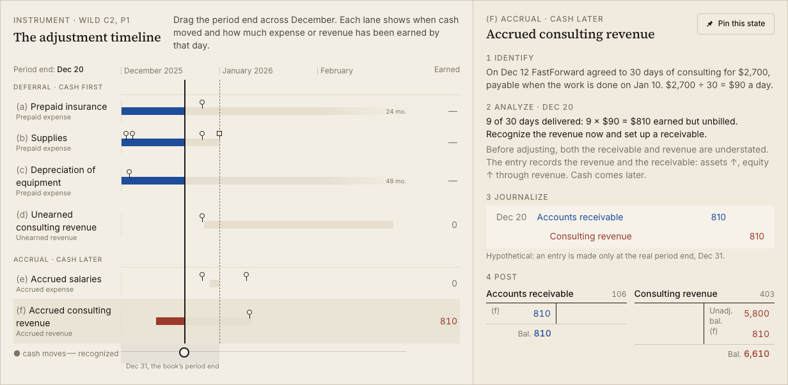
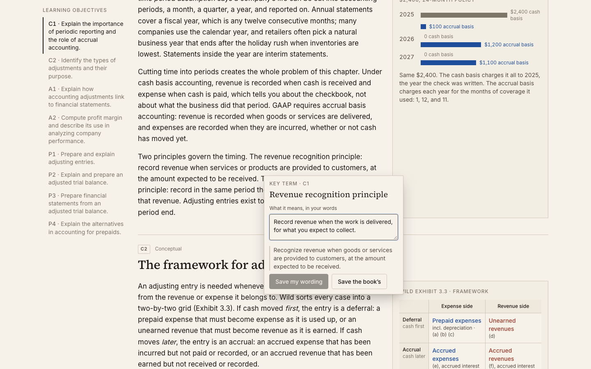
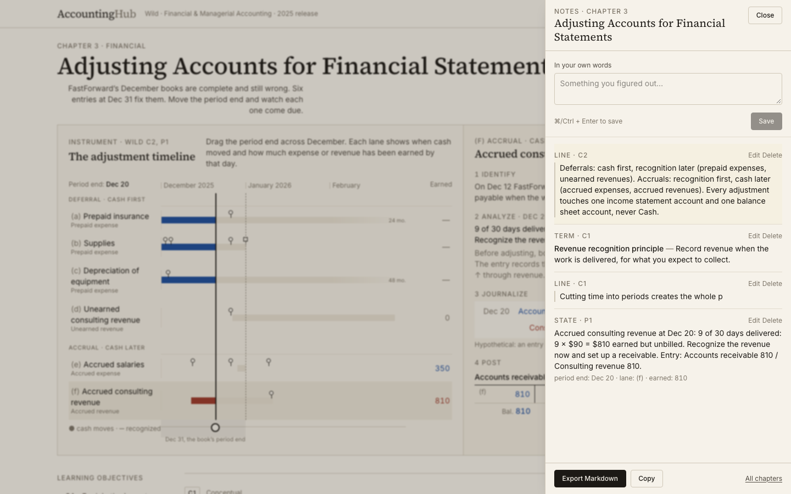

# Accounting Hub

An open study site for John Wild's _Financial and Managerial Accounting_ (2025 release). Each chapter opens on an instrument you can move, the explanation lives around it, and your notes attach to what you were looking at.

Built for ACCT 2301 at UTRGV. Chapters 1–13 (financial) first, 14–24 (managerial) later. Chapter 3, Adjusting Accounts, is live; it was built first because it is the hardest idea in the first half and the best stress test for the template.

**Live:** https://accounting-hub-ebon.vercel.app



## What a chapter is

A chapter is a paced sequence of **stops**, not a page. Each stop fills the viewport and holds one idea: one instrument, one explanation, one drill. A progress rail on the left (a thin bar under 900 px) shows one tick per stop grouped by learning objective; click a tick to jump, or press J / K. Chapter 3 has 17 stops and runs about 30 minutes.

- **An instrument first.** Chapter 3 opens on a timeline of FastForward's December with a period-end scrubber. Six lanes, one per adjustment (a)–(f), show when cash moved and how much expense or revenue has been earned by the scrubbed day. The side panel walks the selected lane through Identify → Analyze → Journalize → Post, with a hypothetical entry and T-accounts for any day you stop on.
- **Wild's learning-objective spine.** Sections follow the book's codes (C1, C2, A1, A2, P1–P4) and cite its exhibits.
- **Every number ties out.** Trial balances, statements, and instrument states are derived from journal entries through a small ledger model. `pnpm validate` asserts Dr = Cr, A = L + E, statement linkage, and the textbook's own totals (45,300 → 47,685, net income 3,785) on every build and in CI.
- **Drills that pay out after.** Sort eight situations into the four adjustment types; journalize the six entries yourself; a quick check across every objective.
- **A recall pass.** The deck is generated from the chapter: entry cards (the flagship: debit account, credit account, amount), classification cards, rule cards (which side increases dividends?), and term cards. Box 1–5 spaced repetition, due in 1 / 2 / 4 / 8 / 16 days, in `localStorage`. `/review` pulls due cards across every chapter you have opened.
- **Mnemonics with a home.** A dedicated stop: deferral = cash first, accrual = cash later; and DEBT / CLOR for the debit-credit rule, with DEBT always printed beside its three accounts (expenses, assets, dividends) and DEAD offered as the decodable alternative. The deck tests the rule, never the acronym.



## How notes work

Notes attach to things, not to a blank pad. Nothing on the page is pre-marked as note-worthy.

| You do this                                     | You get this note                                                                                  |
| ----------------------------------------------- | -------------------------------------------------------------------------------------------------- |
| Select a sentence in a reading                  | A **line** note, quoted, with optional words of your own                                           |
| Select a key term exactly                       | A **term** note. It asks for the meaning in your words first; the book's wording is one click away |
| Move an instrument off its default, then pin it | A **state** note carrying the sentence and the numbers on screen                                   |
| Finish a drill                                  | The takeaway it just taught you, offered once, after the work                                      |
| Reach the chapter end                           | An audit of key terms you never captured, each waiting for your definition                         |
| Type in the drawer                              | An **own words** note                                                                              |

Notes persist in `localStorage` per browser. Each note remembers the stop it came from and links back; the notes page groups by chapter, then by learning objective. Export as Markdown per chapter or for all chapters (for NotebookLM), or as a study sheet: terms in a two-column table beside the chapter's entries as journal blocks, one page per chapter, printable at `/study`. There is no account and no server.





## Visual language

Paper background with a faint grain, Source Serif 4 for headings, Inter with tabular figures for everything numeric. Blue for debit-natured accounts, brick for credit-natured. Single rule above a subtotal, double rule under a final total, dollar signs on the first and last amount of a column. Dark mode is designed from the same tokens. The debit/credit pair is validated for color-vision separation in both modes.

## Stack

SvelteKit (Svelte 5 runes) + Tailwind v4, fully prerendered with `adapter-static`. No database, no auth, no environment variables. Playwright renders every stop at 390, 768, and 1440 px, drives every instrument and drill, and writes the screenshots in `docs/screenshots`. Lighthouse accessibility is 100 on the chapter. The build spec lives in `docs/BUILD-SPEC.md`.

```
src/lib/ledger/        double-entry model: post, trial balance, statements
src/lib/content/       chapter data (objectives, terms, drills, ledgers, textbook anchors)
src/lib/notes/         notes store (runes + localStorage), Markdown and study-sheet export
src/lib/recall/        card generation and the box-1–5 scheduler
src/lib/components/    stops + progress rail, ledger tables, note capture, instruments, drills, recall cards
src/lib/chapters/      one Svelte page per chapter
scripts/validate.ts    the reconciliation check run in CI and before every deploy
tests/visual.spec.ts   Playwright screenshots + interactive-state assertions
```

## Run it

```
pnpm install
pnpm dev            # http://localhost:5173
pnpm validate       # numbers must reconcile
pnpm build && pnpm test:visual   # renders and screenshots the built site
```

## Roadmap

Chapter 2 next (double-entry machine, FastForward's sixteen transactions), then 5 (cost layers), 8 (depreciation curves), 13 (indirect-method waterfall), and the rest of the financial half. See [CONTRIBUTING.md](CONTRIBUTING.md) for how a chapter is added.

## License

MIT. Independent study aid; not affiliated with McGraw Hill. Textbook figures are used for study and reproduce the FastForward example the book teaches from.
